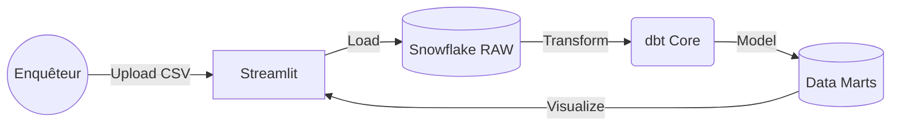

# 📱 Telephony Insights


> **Solution d'intelligence analytique pour l'exploitation des données de téléphonie judiciaire.**

---

## 🔍 Le Projet

**Telephony Insights** est une application conçue pour assister les enquêteurs de police judiciaire dans l'analyse des fadettes (facturations détaillées) et des données de bornage. Face à l'hétérogénéité des formats opérateurs (Orange, SFR, Bouygues, Free), cet outil centralise, normalise et visualise les communications pour transformer des fichiers CSV bruts en renseignement actionnable.

### 🎯 Fonctionnalités Clés

* **Ingestion Universelle :** Support des réquisitions **MT20** (Cible Ligne) et **MT24** (Cible IMEI) multi-opérateurs.
* **Isolation "Dossier" :** Architecture Multi-Tenant garantissant l'étanchéité stricte des données entre deux enquêtes via un `DOSSIER_ID` unique.
* **Cartographie Interactive :** Projection des événements réseaux sur carte (Folium/Mapbox) via le référentiel des antennes relais.
* **Analyse Relationnelle :** Détection automatique des liens **SIM ↔ Boîtier** (Qui utilise quel téléphone ?).

---

## 🏗 Architecture Technique (Modern Data Stack)

L'application repose sur une architecture **ELT (Extract, Load, Transform)** cloud-native, privilégiant la sécurité et la performance.



1. Ingestion & Stockage (Snowflake)

    Stratégie ELT : Chargement des données brutes en VARCHAR (Schema-on-Write) pour éviter les rejets d'import.

    Structure des Données :

        RAW_DATA : Landing zone des fichiers CSV opérateurs.

        DOSSIERS_DB : Gestion des métadonnées d'enquête et journal d'audit (FILES_LOG).

        AUTH_DB : Gestion sécurisée des utilisateurs.

2. Transformation (dbt)

    Normalisation : Standardisation des formats de dates et numéros (MSISDN +33) via des modèles de staging (stg_mt20_orange, stg_mt20_sfr...).

    Modélisation : Création d'un schéma en étoile centré sur la table de faits fct_communications, enrichie par les dimensions dim_antennas et dim_identities.

3. Sécurité & Gouvernance

    Authentification Forte : Utilisation de paires de clés RSA 2048-bit pour les comptes de service techniques.

    RBAC (Role-Based Access Control) : Séparation stricte des privilèges :

        STREAMLIT_ROLE : Lecture Marts / Ecriture Raw uniquement.

        DBT_ROLE : Transformation et création de tables.

📂 Structure du Projet


````text
.
├── dbt/                          # Projet dbt (Transformations)
│   ├── models/
│   │   ├── staging/              # Nettoyage des données brutes
│   │   └── marts/                # Tables finales pour l'UI
│   └── dbt_project.yml
├── scripts/
│   └── hash_password.py          # Utilitaires de sécurité
├── snowflake/
│   └── 00_INIT_INFRASTRUCTURE.sql # Setup Infra (Roles, DBs, Warehouses)
└── streamlit/                    # Application Frontend
    ├── app/
    │   ├── main.py               # Point d'entrée
    │   ├── pages/                # Pages (Gestion Dossiers, Carto...)
    │   └── modules/              # Logique métier et Dataviz
    └── Dockerfile                # Conteneurisation de l'app
`````

🚀 Installation & Démarrage

Pré-requis

    Compte Snowflake actif.

    Python 3.8+.

    Clé RSA générée pour l'utilisateur de service.

1. Setup Infrastructure

Exécuter le script SQL dans une worksheet Snowflake pour créer les objets nécessaires :

````SQL

-- Voir snowflake/00_INIT_INFRASTRUCTURE_FULL.sql

````

2. Configuration dbt

Remplir le fichier profiles.yml avec vos identifiants Snowflake (Authentification Key-Pair recommandée).

3. Lancement de l'App

````Bash

cd streamlit/app
pip install -r requirements.txt
streamlit run main.py
````

🛡 Sécurité & Confidentialité

Ce projet a été conçu avec une approche "Privacy by Design" :

    Traçabilité : Chaque fichier importé est logué dans FILES_LOG avec l'empreinte de l'utilisateur.

    Cloisonnement : Aucune donnée n'est partagée entre les DOSSIER_ID.

    Chiffrement : Données chiffrées au repos et en transit (TLS 1.2).

Projet réalisé par Antoine Pelamourgues.
